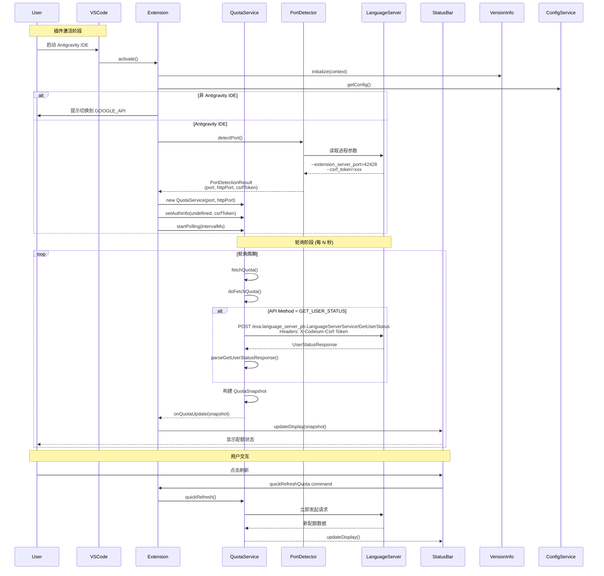
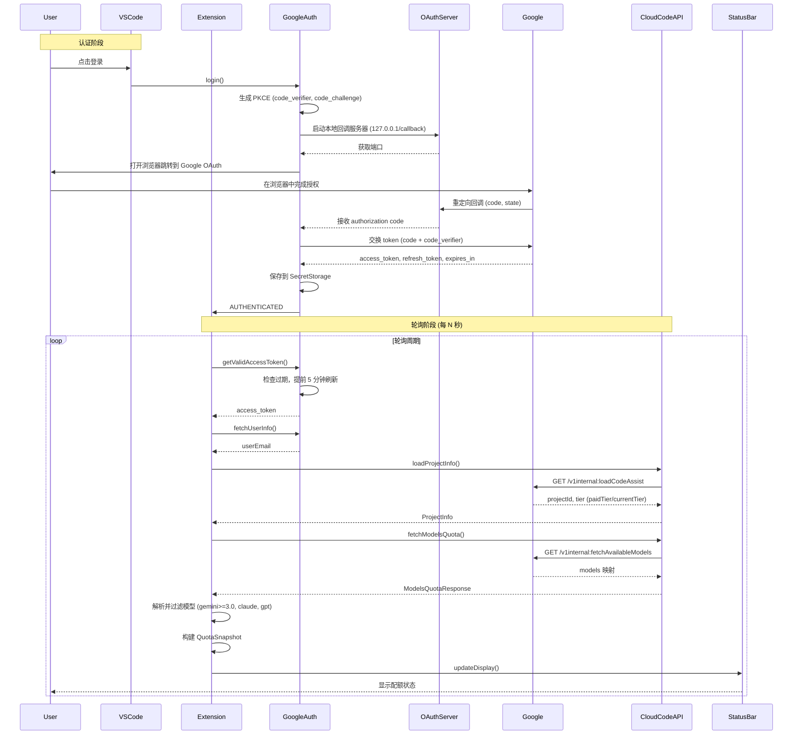

## Antigravity 本地模式配额查询实现方案

本文档详细介绍了 Antigravity IDE 插件中本地模式配额查询的实现细节。该模式通过直接请求本地语言服务器（Language Server）获取当前用户的模型配额和 Prompt 额度。

### 一、时序图



### 二、核心常量

| 常量名 | 值 | 用途 |
|--------|-----|------|
| `GET_USER_STATUS_PATH` | `/exa.language_server_pb.LanguageServerService/GetUserStatus` | API 端点路径 |
| `Connect-Protocol-Version` | `1` | 连接协议版本头 |
| `X-Codeium-Csrf-Token` | (动态值) | CSRF 认证头 |
| `Content-Type` | `application/json` | 请求内容类型 |
| `timeout` | `5000` (ms) | 请求超时时间 |
| `MAX_RETRY_COUNT` | `3` | 最大重试次数 |
| `RETRY_DELAY_MS` | `5000` | 重试间隔 |

**进程检测参数** (从 language_server 进程命令行提取):
```bash
--extension_server_port=42428      # HTTP 备用端口
--csrf_token=xxxxxxxxxxxx          # CSRF 令牌
```

### 三、数据结构

#### 3.1 请求相关

```typescript
// 请求配置 (makeRequest)
interface RequestConfig {
  path: string;              // API 路径
  body: object;              // 请求体
  timeout?: number;          // 超时时间 (可选)
}

// 请求头
headers: {
  'Content-Type': 'application/json',
  'Content-Length': number,
  'Connect-Protocol-Version': '1',
  'X-Codeium-Csrf-Token': string  // 动态注入的值
}

// 请求体 (makeGetUserStatusRequest)
{
  "metadata": {
    "ideName": "antigravity",
    "extensionName": "antigravity",
    "ideVersion": "x.x.x",      // 从 IDE 环境读取
    "locale": "en"
  }
}
```

#### 3.2 响应相关

```typescript
// UserStatusResponse (API 响应)
interface UserStatusResponse {
  userStatus: {
    name: string;             // 用户名
    email: string;            // 用户邮箱
    planStatus?: {
      planInfo: {
        teamsTier: string;    // 团队层级
        planName: string;     // 计划名称
        monthlyPromptCredits: number;  // 月度配额
        monthlyFlowCredits: number;    // 月度 Flow 配额
      };
      availablePromptCredits: number;  // 剩余 Prompt 配额
      availableFlowCredits: number;    // 剩余 Flow 配额
    };
    cascadeModelConfigData?: {
      clientModelConfigs: ModelConfig[];
    };
    userTier?: {
      id: string;             // 如 'free', 'pro'
      name: string;           // 如 'Free', 'Pro'
      description: string;
    };
  };
}

// 模型配置
interface ModelConfig {
  label: string;              // 显示名称，如 'Claude 3.5 Sonnet'
  modelOrAlias: {
    model: string;            // 模型 ID，如 'claude-3-5-sonnet'
  };
  quotaInfo?: {
    remainingFraction?: number;   // 剩余比例 0-1
    resetTime: string;            // ISO 8601 时间
  };
  supportsImages?: boolean;
  isRecommended?: boolean;
  allowedTiers?: string[];
}
```

#### 3.3 内部数据结构

```typescript
// 解析后的 Prompt 配额
interface PromptCreditsInfo {
  available: number;          // 剩余配额
  monthly: number;            // 月度总量
  usedPercentage: number;     // 已用百分比
  remainingPercentage: number; // 剩余百分比
}

// 解析后的模型配额
interface ModelQuotaInfo {
  label: string;              // 显示名称
  modelId: string;            // 模型 ID
  remainingFraction?: number; // 剩余比例 (0-1)
  remainingPercentage?: number;
  isExhausted: boolean;       // 是否耗尽
  resetTime: Date;            // 重置时间
  timeUntilReset: number;     // 距离重置的毫秒数
  timeUntilResetFormatted: string; // 格式化字符串，如 "2h30m from now"
}

// 完整配额快照
interface QuotaSnapshot {
  timestamp: Date;            // 获取时间
  promptCredits?: PromptCreditsInfo;  // Prompt 配额 (本地 API 专属)
  models: ModelQuotaInfo[];   // 模型配额列表
  planName?: string;          // 账号级别 (来自 userTier.name)
  userEmail?: string;         // Google 邮箱 (GOOGLE_API 专属)
  isStale?: boolean;          // 数据是否过时
}
```

#### 3.4 端口检测结果

```typescript
interface PortDetectionResult {
  port: number;               // HTTPS 主端口 (Connect)
  connectPort: number;        // 同 port
  httpPort: number;           // HTTP 备用端口 (extension_server_port)
  csrfToken: string;          // CSRF 令牌
  source: 'process';
  confidence: 'high';
}
```

#### 四、API 调用示例

#### 4.1 Request

```http
POST /exa.language_server_pb.LanguageServerService/GetUserStatus HTTP/1.1
Host: 127.0.0.1:{detectedPort}
Content-Type: application/json
Content-Length: 123
Connect-Protocol-Version: 1
X-Codeium-Csrf-Token: {csrfToken}

{
  "metadata": {
    "ideName": "antigravity",
    "extensionName": "antigravity",
    "ideVersion": "1.11.2",
    "locale": "en"
  }
}
```

#### 4.2 Response (成功)

```json
{
  "userStatus": {
    "name": "John Doe",
    "email": "john@example.com",
    "planStatus": {
      "planInfo": {
        "teamsTier": "individual",
        "planName": "Pro",
        "monthlyPromptCredits": 500000,
        "monthlyFlowCredits": 1000
      },
      "availablePromptCredits": 350000,
      "availableFlowCredits": 750
    },
    "cascadeModelConfigData": {
      "clientModelConfigs": [
        {
          "label": "Claude 3.5 Sonnet",
          "modelOrAlias": {
            "model": "claude-3-5-sonnet"
          },
          "quotaInfo": {
            "remainingFraction": 0.7,
            "resetTime": "2025-02-01T00:00:00Z"
          },
          "supportsImages": true,
          "isRecommended": true
        },
        {
          "label": "Gemini 1.5 Pro",
          "modelOrAlias": {
            "model": "gemini-1-5-pro"
          },
          "quotaInfo": {
            "remainingFraction": 0.45,
            "resetTime": "2025-02-01T00:00:00Z"
          },
          "supportsImages": true
        }
      ]
    },
    "userTier": {
      "id": "pro",
      "name": "Pro",
      "description": "Pro Plan"
    }
  }
}
```

### 五、核心实现细节

1. **动态端口检测**：
   - 首先从 `language_server` 进程命令行中提取 `--extension_server_port`（HTTP 备用）和 `--csrf_token`。
   - 随后遍历该进程监听的所有端口，通过探测 `GetUnleashData` 端点找到可用的 HTTPS 端口作为 `connectPort`。

2. **CSRF 认证注入**：
   - 在初始化后，注入从进程中获取的 CSRF Token。
   - 所有后续 API 请求均会在 Header 中包含 `X-Codeium-Csrf-Token`。

3. **协议自动回退**：
   - 请求默认使用 HTTPS (`connectPort`)。
   - 若捕获到 `EPROTO` 或包含 `wrong_version_number` 的错误（通常意味着该端口仅支持 HTTP），则自动回退并尝试使用 HTTP 协议访问 `httpPort`。

4. **容错与轮询**：
   - 默认轮询间隔为 60 秒，失败时会触发指数退避重试（最大 3 次，间隔 5 秒）。
   - 网络错误或超时会导致数据被标记为 `isStale: true`。

5. **配额计算逻辑**：
   - **Prompt 配额**：`remainingPercentage = (available / monthly) * 100`。
   - **模型配额**：`remainingPercentage = remainingFraction * 100`。
   - **账号计划**：优先解析 `userStatus.userTier.name` 作为显示名称（如 "Free", "Pro"）。

### 六、Google Cloud Code API 模式

#### 6.1 时序图



#### 6.2 核心常量

| 常量名 | 值 | 用途 |
|--------|-----|------|
| `CLOUD_CODE_API_BASE` | `https://cloudcode-pa.googleapis.com` | Google Cloud Code API 基础 URL |
| `LOAD_CODE_ASSIST_PATH` | `/v1internal:loadCodeAssist` | 获取项目信息和订阅等级 |
| `FETCH_AVAILABLE_MODELS_PATH` | `/v1internal:fetchAvailableModels` | 获取模型配额列表 |
| `GOOGLE_CLIENT_ID` | `1071006060591-tmhssin2h21lcre235vtolojh4g403ep.apps.googleusercontent.com` | OAuth 客户端 ID |
| `GOOGLE_CLIENT_SECRET` | `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` | OAuth 客户端密钥 |
| `GOOGLE_AUTH_ENDPOINT` | `https://accounts.google.com/o/oauth2/v2/auth` | OAuth 授权 URL |
| `GOOGLE_TOKEN_ENDPOINT` | `https://oauth2.googleapis.com/token` | OAuth Token 交换 URL |
| `GOOGLE_SCOPES` | `https://www.googleapis.com/auth/cloud-platform https://www.googleapis.com/auth/userinfo.email https://www.googleapis.com/auth/userinfo.profile https://www.googleapis.com/auth/cclog https://www.googleapis.com/auth/experimentsandconfigs` | OAuth 权限作用域 |
| `CALLBACK_HOST` | `127.0.0.1` | OAuth 回调主机 |
| `CALLBACK_PATH` | `/callback` | OAuth 回调路径 |
| `AUTH_TIMEOUT_MS` | `60000` | OAuth 回调等待超时 (1 分钟) |
| `API_TIMEOUT_MS` | `10000` | API 请求超时 (10 秒) |
| `MAX_RETRIES` | `3` | API 请求最大重试次数 |
| `RETRY_DELAY_MS` | `1000` | API 重试间隔基数 (1 秒，指数退避) |
| `TOKEN_STORAGE_KEY` | `antigravity-quota-watcher.google-oauth-token` | Token 存储键名 |

#### 6.3 认证状态

```typescript
// 认证状态枚举
enum AuthState {
    NOT_AUTHENTICATED = 'not_authenticated',  // 未登录，无 Token
    AUTHENTICATING = 'authenticating',        // OAuth 流程进行中
    AUTHENTICATED = 'authenticated',          // 已认证（持有 refresh token）
    TOKEN_EXPIRED = 'token_expired',          // Access token 过期，refresh token 仍有效
    REFRESHING = 'refreshing',                // Token 刷新中
    ERROR = 'error',                          // 认证错误
}

// 认证状态信息
interface AuthStateInfo {
    state: AuthState;
    error?: string;      // 错误信息
    email?: string;      // 用户邮箱
}

// Token 数据结构 (存储在 SecretStorage)
interface TokenData {
    accessToken: string;
    refreshToken: string;
    expiresAt: number;   // 过期时间戳
    tokenType: string;
    scope: string;
    source: 'manual' | 'imported';  // 来源：手动 OAuth 或从 Antigravity 导入
}
```

#### 6.4 API 数据结构

```typescript
// API 错误类
class GoogleApiError extends Error {
    statusCode: number;
    errorCode?: string;
    
    // 是否可以重试 (5xx 或 429)
    isRetryable(): boolean {
        return this.statusCode >= 500 || this.statusCode === 429;
    }
    
    // 是否需要重新登录 (401)
    needsReauth(): boolean {
        return this.statusCode === 401;
    }
}

// 项目信息 (loadCodeAssist 响应)
interface ProjectInfo {
    projectId: string;   // 项目 ID
    tier: string;        // 订阅等级: 'FREE', 'PRO', 'TEAMS'
}

// 模型配额信息 (API 返回)
interface ModelQuotaFromApi {
    modelName: string;           // 模型名称，如 'gemini-3-0-pro'
    displayName: string;         // 显示名称，如 'Gemini 3.0 Pro'
    remainingQuota: number;      // 剩余比例 (0-1)
    resetTime: string;           // ISO 8601 格式重置时间
    isExhausted: boolean;        // 是否已耗尽
}

// 模型配额列表响应
interface ModelsQuotaResponse {
    models: ModelQuotaFromApi[];
}

// 用户信息响应 (OAuth userinfo API)
interface UserInfoResponse {
    id: string;
    email: string;
    verified_email: boolean;
    name?: string;
    picture?: string;
}

// Token 交换响应
interface TokenResponse {
    access_token: string;
    refresh_token?: string;
    expires_in: number;
    token_type: string;
    scope: string;
}
```

#### 6.5 API 调用示例

##### 6.5.1 OAuth 授权 URL 构建

```http
GET https://accounts.google.com/o/oauth2/v2/auth?
    client_id=1071006060591-tmhssin2h21lcre235vtolojh4g403ep.apps.googleusercontent.com&
    redirect_uri=http://127.0.0.1:34567/callback&
    response_type=code&
    scope=https://www.googleapis.com/auth/cloud-platform%20https://www.googleapis.com/auth/userinfo.email%20https://www.googleapis.com/auth/userinfo.profile%20https://www.googleapis.com/auth/cclog%20https://www.googleapis.com/auth/experimentsandconfigs&
    state={随机state}&
    code_challenge={PKCE challenge}&
    code_challenge_method=S256
```

##### 6.5.2 Token 交换

```http
POST https://oauth2.googleapis.com/token
Content-Type: application/x-www-form-urlencoded

client_id=1071006060591-tmhssin2h21lcre235vtolojh4g403ep.apps.googleusercontent.com&
client_secret=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&
code={authorization_code}&
code_verifier={PKCE verifier}&
grant_type=authorization_code&
redirect_uri=http://127.0.0.1:34567/callback
```

**Token 交换响应**:
```json
{
    "access_token": "ya29.a0AfH6SMB...",
    "expires_in": 3600,
    "refresh_token": "1//0gYJ8F...", 
    "scope": "https://www.googleapis.com/auth/cloud-platform ...",
    "token_type": "Bearer"
}
```

##### 6.5.3 loadCodeAssist (获取项目信息)

```http
POST https://cloudcode-pa.googleapis.com/v1internal:loadCodeAssist HTTP/1.1
Authorization: Bearer {access_token}
Content-Type: application/json

{
    "metadata": {
        "ideType": "ANTIGRAVITY"
    }
}
```

**响应**:
```json
{
    "cloudaicompanionProject": "projects/my-project-123",
    "paidTier": {
        "id": "PRO"
    },
    "currentTier": {
        "id": "FREE"
    }
}
```

##### 6.5.4 fetchAvailableModels (获取模型配额)

```http
POST https://cloudcode-pa.googleapis.com/v1internal:fetchAvailableModels HTTP/1.1
Authorization: Bearer {access_token}
Content-Type: application/json

{
    "project": "projects/my-project-123"
}
```

**响应**:
```json
{
    "models": {
        "gemini-3-0-pro": {
            "quotaInfo": {
                "remainingFraction": 0.75,
                "resetTime": "2025-02-01T00:00:00Z"
            }
        },
        "claude-3-5-sonnet": {
            "quotaInfo": {
                "remainingFraction": 0.25,
                "resetTime": "2025-02-01T00:00:00Z"
            }
        },
        "gemini-1-5-pro": {
            "quotaInfo": {
                "remainingFraction": 0.5,
                "resetTime": "2025-02-01T00:00:00Z"
            }
        },
        "some-internal-model": {
            "quotaInfo": {
                "remainingFraction": 1.0,
                "resetTime": "2025-02-01T00:00:00Z"
            }
        }
    }
}
```

##### 6.5.5 fetchUserInfo (获取用户邮箱)

```http
GET https://www.googleapis.com/oauth2/v2/userinfo HTTP/1.1
Authorization: Bearer {access_token}
```

**响应**:
```json
{
    "id": "123456789",
    "email": "user@gmail.com",
    "verified_email": true,
    "name": "John Doe",
    "picture": "https://lh3.googleusercontent.com/..."
}
```

#### 6.6 模型过滤规则

从 `fetchAvailableModels` 返回的 `models` 映射中，按以下规则过滤：

1. **模型名称匹配**：只保留名称包含 `gemini`、`claude` 或 `gpt` 的模型（不区分大小写）
2. **Gemini 版本过滤**：Gemini 模型必须版本 >= 3.0
   - `gemini-3-0-pro` ✅ (version 3.0 >= 3.0)
   - `gemini-2-5-flash` ❌ (version 2.5 < 3.0)
   - `gemini-1-5-pro` ❌ (version 1.5 < 3.0)
   - `gemini-pro` ❌ (未带版本号，默认按旧版本处理)
   - `claude-3-5-sonnet` ✅ (非 Gemini，直接通过)
   - `gpt-4o` ✅ (非 Gemini，直接通过)

**版本提取正则**:
```typescript
// 匹配 gemini-X.X 或 gemini-X.X-xxx 格式
const versionMatch = modelName.match(/gemini-(\d+(?:\.\d+)?)/);
if (versionMatch) {
    const version = parseFloat(versionMatch[1]);
    return version >= 3.0;
}
// 未匹配到版本号的 Gemini (如 gemini-pro) 默认过滤
return false;
```

**显示名称格式化**:
```typescript
// "gemini-3-0-pro" -> "Gemini 3.0 Pro"
// "claude-3-5-sonnet" -> "Claude 3.5 Sonnet"
function formatModelDisplayName(modelName: string): string {
    // 1. 修复版本号格式：3-5 -> 3.5
    const fixed = modelName.replace(/(\d+)-(\d+)/g, '$1.$2');
    // 2. 按 '-' 分割，首字母大写
    return fixed.split('-').map(part => {
        if (/^\d/.test(part)) return part;  // 数字部分保持原样
        return part.charAt(0).toUpperCase() + part.slice(1);
    }).join(' ');
}
```

#### 6.7 核心实现细节

1. **OAuth PKCE 流程**：
   - 生成随机 `code_verifier` (32 字节 base64url)
   - 用 `code_verifier` 计算 `code_challenge` (SHA256 + base64url)
   - 授权 URL 包含 `state` (CSRF 保护) 和 `code_challenge`
   - 回调接收 `code`，用 `code_verifier` 交换 token

2. **Token 管理**：
   - Token 存储在 VS Code `SecretStorage`（加密）
   - Access token 提前 5 分钟判定过期并自动刷新
   - 持有 refresh token 即视为 `AUTHENTICATED`（即使 access token 过期）

3. **认证状态流转**：
   - 初始化时：有 token → `AUTHENTICATED`
   - 登录：`NOT_AUTHENTICATED` → `AUTHENTICATING` → `AUTHENTICATED`
   - Token 过期：`AUTHENTICATED` → `TOKEN_EXPIRED`
   - 刷新 Token：`TOKEN_EXPIRED` → `REFRESHING` → `AUTHENTICATED`
   - 刷新失败：`REFRESHING` → `TOKEN_EXPIRED`
   - 登出：任意状态 → `NOT_AUTHENTICATED`

4. **API 错误处理**：
   - **401 Unauthorized**：`needsReauth() = true`，停止轮询，提示重新登录
   - **5xx Server Error**：`isRetryable() = true`，触发重试（指数退避：1s, 2s, 3s）
   - **429 Rate Limit**：`isRetryable() = true`，触发重试
   - **网络错误/超时**：标记数据为 `isStale: true`，继续轮询

5. **配额计算**：
   - `remainingPercentage = remainingQuota * 100`
   - `isExhausted = remainingQuota <= 0`
   - `resetTime` 缺失时默认设为 24 小时后

6. **从 Antigravity 导入**：
   - 可从本地 Antigravity SQLite 数据库提取 `refresh_token`
   - 调用 `loginWithRefreshToken()` 直接获取新的 access token
   - 存储时标记 `source: 'imported'`
